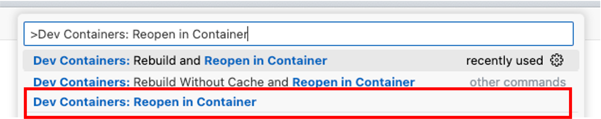
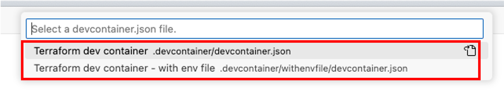
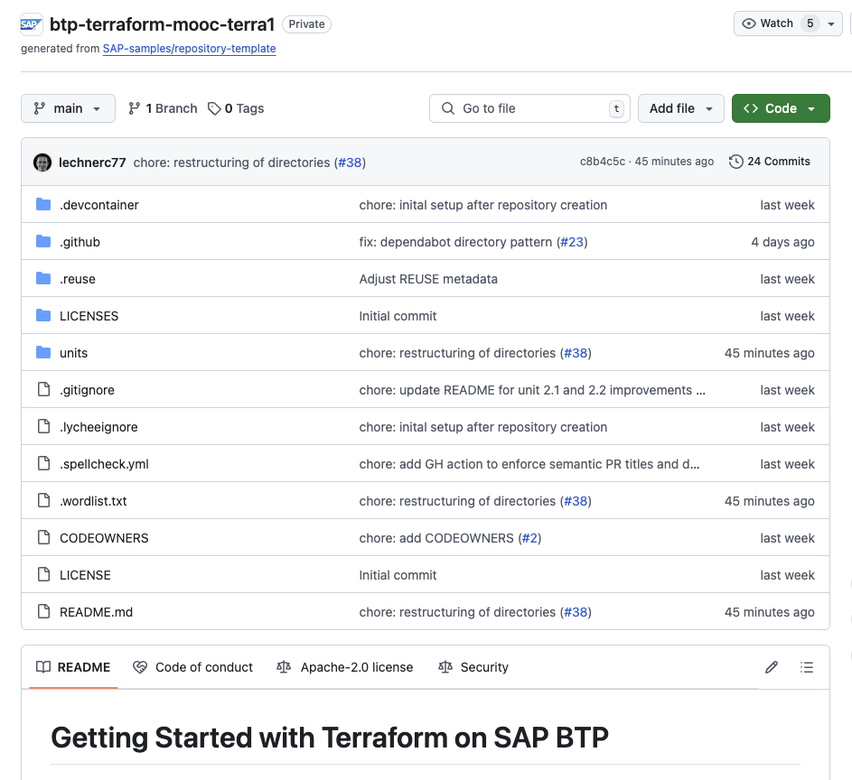

# Unit 1 Lesson 3 - Preparing the setup for Terraform on SAP BTP

## Goal 🎯

The goal of this unit is get the technical prerequisites in place for getting started with Terraform in your setup.

## Technical Setup 🛠️

To execute the exercises, you have the following options concerning the required tools installed:

- *Recommended*: [Use the provided dev container](#dev-container-recommended)
- [Use of GitHub Codespaces](#github-codespace)
- [Local installation](#local-installation)

You find details about the installation of the tools in the following sections

You can also clone this repository to have the instructions and the code locally inside your editor of choice. You can also walk through the lessons here on GitHub.

You can clone the repository via the following command:

```bash
git clone https://github.com/SAP-samples/btp-terraform-mooc-terra1.git
```

All the units are located in the directory `units`.

### Dev container (recommended)

You can use the provided dev container that contains all required tools. This requires that you have [Docker](https://www.docker.com/products/docker-desktop) installed on your machine. In addition you need [Visual Studio Code](https://code.visualstudio.com/) including the [Dev Containers](https://marketplace.visualstudio.com/items?itemName=ms-vscode-remote.remote-containers) extension installed on your machine. You find detailed instructions about the setup [here](https://code.visualstudio.com/docs/devcontainers/containers#_getting-started).

To use the dev container you must clone the GitHub repository as described above via:

```bash
git clone https://github.com/SAP-samples/btp-terraform-mooc-terra1.git
```

To start a dev container Docker must be running on your machine.

To use the dev container open the directory that contains the cloned repository in Visual Studio Code.

You will be then asked if you want to reopen the folder in the dev container. Don't do that yet.

We provide two variants of the dev container configuration.

- a dev container with the Terraform setup in place. You must provide the authentication information as described in the lessons. This configuration is called `Terraform dev container`
- a dev container with the Terraform setup in place. In addition the dev container will inject the environment variables used for authentication from a `.env` file so that you are already fully set up from an authentication perspective. This configuration is called `Terraform dev container - with env file`

If you want to use the one called `Terraform devcontainer - with env file` you must first execute the steps described in the following section, otherwise directly jump to section [Starting the dev container](#starting-the-dev-container).

### Creating the devcontainer.env file

Open the cloned repository and create a new file called `devcontainer.env` file in the `.devcontainer/` directory (**not** the `.devcontainer/with_env_file/` directory), with the following environment variables:

```bash
BTP_USERNAME=<your SAP BTP username>
BTP_PASSWORD=<your SAP BTP password>
CF_USER=<your SAP BTP username>
CF_PASSWORD=<your SAP BTP password>
```

Save the file and proceed with starting the dev container as described in the following section.

### Starting the dev container

To (re)open the cloned directory in the dev container execute the following steps:

1. Open the command palette in Visual Studio Code:

    - Windows / Linux: `Ctrl + Shift + P`
    - Mac: `Cmd + Shift + P`

1. Enter `Dev Containers: Reopen in Container` and confirm with `Enter`.

    

1. You will then be asked to select a dev container. Select the variant of your choice. If you chose the variant `Terraform dev container - with env file` make sure that you have gone through the actions of section [Creating the dev container.env file](#creating-the-devcontianerenv-file):

    

The dev container will automatically start and you are ready to go.

### GitHub Codespace

To use [Codespaces](https://docs.github.com/codespaces/overview) you must have a GitHub account. If you don't have one, [sign-up on GitHub](https://github.com/signup) before going through the following steps.

You can then access the Codespace following these steps:

1. Open the [GitHub repository "Getting Started with Terraform on SAP BTP"](https://github.com/SAP-samples/btp-terraform-mooc-terra1).

    

1. Click on this button and create the Codespace:

   [](https://github.com/codespaces/new?hide_repo_select=true&ref=main&repo=892078617&skip_quickstart=true&machine=basicLinux32gb&geo=EuropeWest&devcontainer_path=.devcontainer%2Fdevcontainer.json)


1. A configuration overview will be opened in the browser. You can adjust the region to a location near you (1) and confirm the creation of the Codespace (2):

    

    This will take a few minutes.

1. While the Codespace is created for you, you will see this screen

    

1. Once all is done, you are in your Codespace.

    

> [!IMPORTANT]
> GitHub codespaces are [free for a certain amount of time per month](https://docs.github.com/en/billing/managing-billing-for-your-products/managing-billing-for-github-codespaces/about-billing-for-github-codespaces#monthly-included-storage-and-core-hours-for-personal-accounts). For the hands-on session the free time is more than enough. **Don't forget to delete your codespace again when you are finished!**


### Local installation

You can install the required tools locally on your machine. The following tools are required:

- [Terraform CLI](https://developer.hashicorp.com/terraform/install?product_intent=terraform)
- An editor of your choice. We recommend [Visual Studio Code](https://code.visualstudio.com/Download) with the [Terraform extension](https://marketplace.visualstudio.com/items?itemName=HashiCorp.terraform).


## Cleanup SAP BTP Account

We are going to provision several resources like entitlements and subscriptions through the course of this course. As we are working in a trial account there might be limitations e.g., concerning the available quotas.

It is therefore recommended to create a new trial account and delete the already existing subaccount from the global account, so that you start from an *empty* global account

## Summary 🪄

All the technical prerequisites are in place. Now we can start with the fun part namely with setting up the Terraform configuration

With that let us continue with [Unit 2 Lesson 1 - Configuring the first basic Terraform setup](../../unit_2/lesson_1/README.md)
