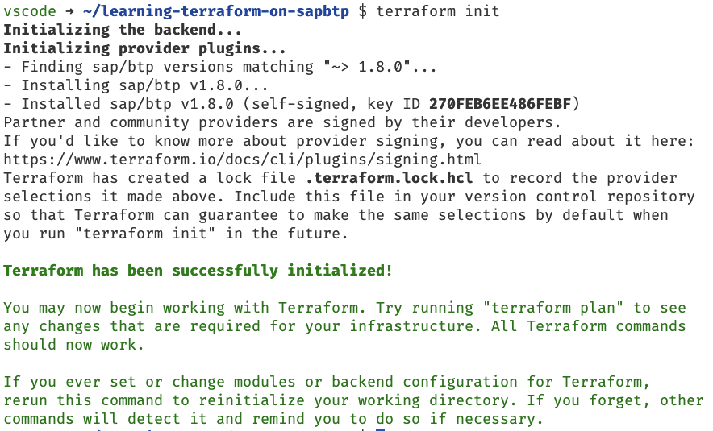
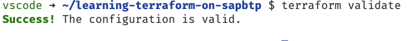
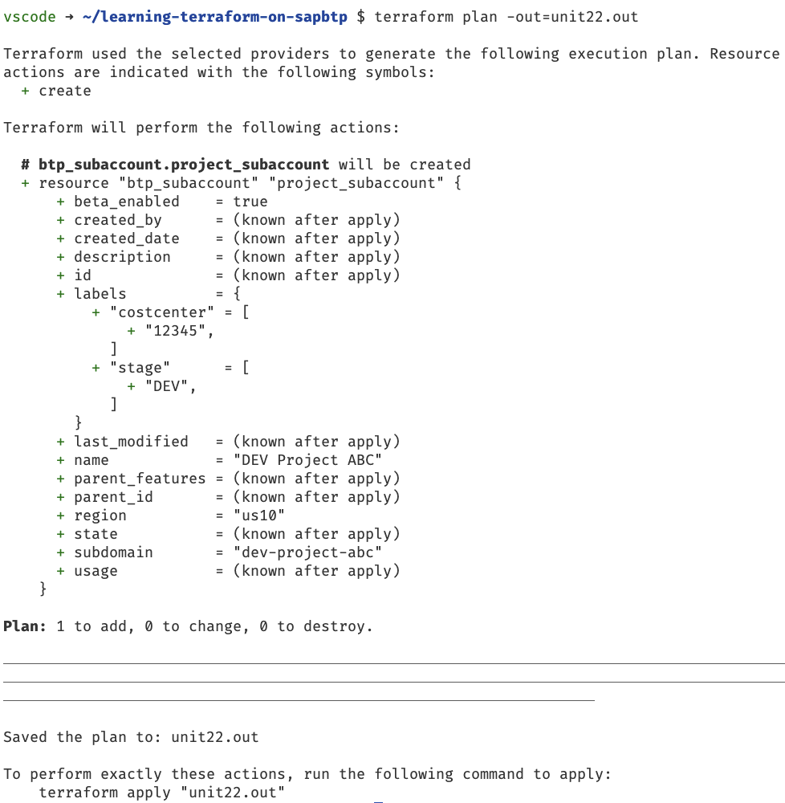
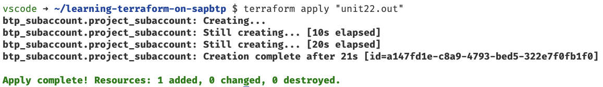
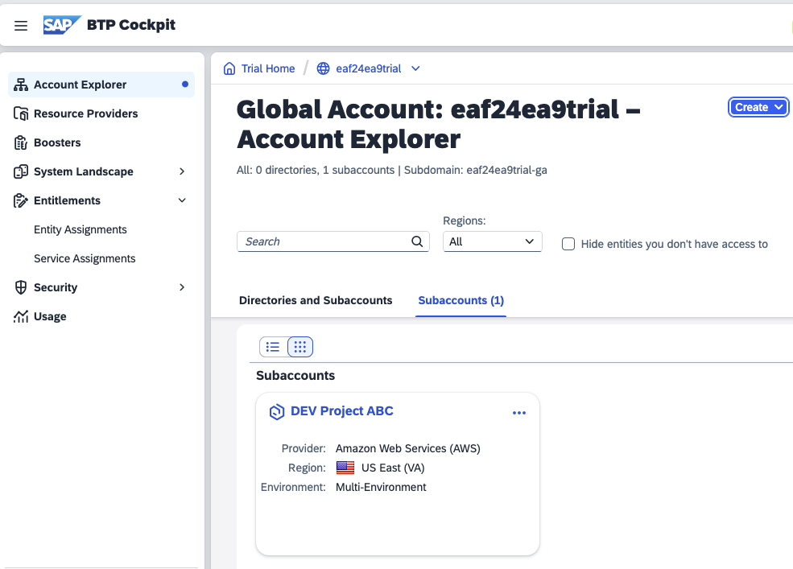

# Unit 2 Lesson 2 - Applying the Terraform setup to SAP BTP

## Goal 🎯

The goal of this unit is to create and apply the configuration of a subaccount on SAP BTP. At the end of the unit you will have created a new subaccount on SAP BTP using Terraform

## Setting up a subaccount 🛠️


### Crafting the Terraform configuration

To continue our Terraform journey we add a new file called `main.tf` in the directory `learning-terraform-on-sapbtp` we created in the previous unit. This file will be the home of your Terraform configuration.

As we want to create a subaccount, we need to know what data to provide to Terraform. Where can we find this information? The perfect place is the Terraform registry that contains the [provider documentation](https://registry.terraform.io/providers/SAP/btp/latest/docs).

We find two types of entities that are part of the provider:

- *Resources* - resources are used to create, update and delete infrastructure via Terraform
- *Data Sources* - data sources can be seen as readers that enable Terraform to fetch information and attributes from the infrastructure to use it in the Terraform configuration. We can read the information of infrastructure that is managed or is not managed by Terraform

As we want to create a subaccount, we must take a closer look at the resources in the documentation. Here we find a resource called [`btp_subaccount`](https://registry.terraform.io/providers/SAP/btp/latest/docs/resources/subaccount) that fits for our needs.

The resource has some mandatory and some optional fields. We have the following requirements for our subaccount that need to be mapped to the attributes of the resource:

- The `name` of the subaccount should have the value `DEV Project ABC`
- The `subdomain` of the subaccount should have the value of the name, but all in lower case and spaces should be replaced by dashes. For this unit we statically code this value as `dev-project-abc`
- We want to have beta features enabled
- We want to have two labels:
   - one for the stage the subaccount belongs to with the key `stage` and the value `DEV`
   - one for the cost center with key `costcenter` and value `12345`

We choose the region that is fitting for us.

> [!NOTE]
> Be aware that the SAP BTP trial is available in the regions `us10` and `ap21` only.

Let us get these requirements into the code. We add the following Terraform configuration into the `main.tf` file:

```terraform
resource "btp_subaccount" "project_subaccount" {
  name         = "DEV Project ABC"
  subdomain    = "dev-project-abc"
  region       = "us10"
  beta_enabled = true
  labels = {
    "stage"      = ["DEV"]
    "costcenter" = ["12345"]
  }
}
```

This tells Terraform to create a resource of type `btp_subaccount`. We give the resource the name `project subaccount`.

> [!TIP]
> We will see the meaning of the resource name in the next unit ["Inspecting the Terraform state"](../lesson_3/README.md).

We added the values of the mandatory and optional parameters as defined by the requirements for our setup. Save the changes.

Next we will apply the configuration to our SAP BTP global account.

### Applying the Terraform configuration to SAP BTP

Let us apply this first configuration. The application of configurations follows a specific flow:

1. We must initialize our working directory and download the providers. To do so we open a terminal and execute the following command:

   ```bash
   terraform init
   ```
   We see the following result:

   

1. Next we should make sure that the formatting of the code is aligned with the canonical formatting defined for the Hashicorp Configuration language. We execute the following command:

   ```bash
   terraform fmt
   ```
   No output appeared, which means that everything was formatted correctly. If some file names appear, don't worry, that means that Terraform code was brought into the canonical format.

1. After that it makes sense to do a static validation of our code where we do not yet need a connection to SAP BTP. We execute the following command:

   ```bash
   terraform validate
   ```
   We see the following result - validation passed:

   

1. Now let us get serious. We execute a planning to check what Terraform intends to do based on our configuration. Execute the following command:

   ```bash
   terraform plan -out=unit22.out
   ```
   We see the following result:

   

   This looks like what we want to achieve right? We stored this plan using the `-out` parameter.

1. We apply the stored plan and finally create our first resource on SAP BTP via the command:

   ```bash
   terraform apply "unit22.out"
   ```
   We see the following result:

   

Let is also check that in the SAP BTP Cockpit:



Great! We just created our first subaccount on SAP BTP using Terraform. Time for a short coffee break ☕, what do you think 😎

> [!NOTE]
> 1. The `terraform init` command must be usually executed only once when starting in a new directory. As long as no additional Terraform provider is added to the configuration or modules are added we can skip this command.
> 2. The stored plan is a binary format that we cannot directly inspect. The Terraform CLI provides the `terraform show` command to transfer the content into a human readable format.

## Summary 🪄

We created our first Terraform configuration which provisioned a subaccount on SAP BTP. In the course of this provisioning we walked through a typical Terraform flow.

With that let us continue with [Unit 2 Lesson 3 - Inspecting the Terraform state](../lesson_3/README.md)

## Sample Solution 🛟

You find the sample solution in the directory `units/unit_2/lesson_2/solution_u2_l2`.

## Further References 📝

- [Terraform command reference](https://developer.hashicorp.com/terraform/cli/commands)
