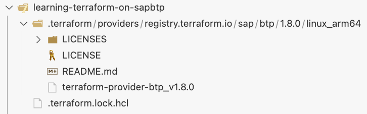
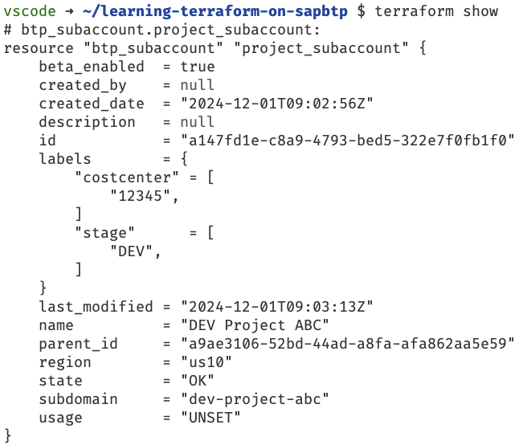
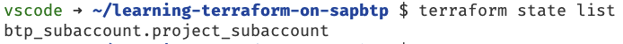
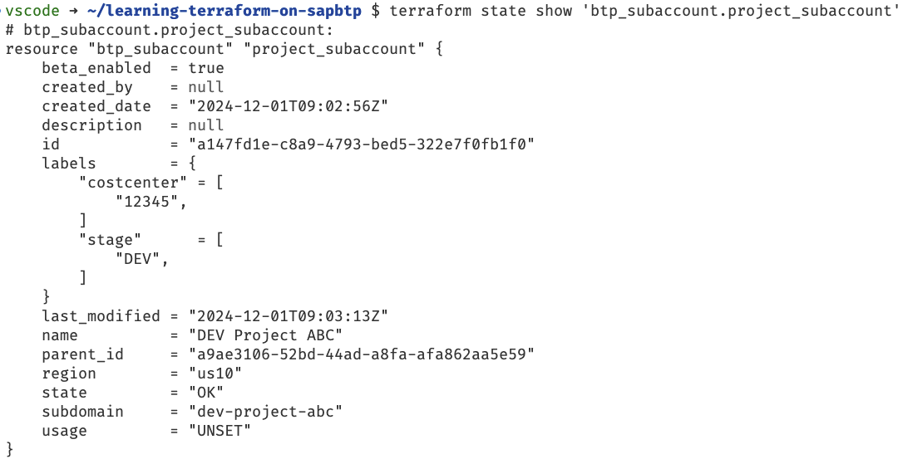

# Unit 2 Lesson 3 - Inspecting the Terraform state

## Goal 🎯

The goal of this unit is to take a closer look at the *state* file of Terraform. We will investigate what information is stored in this file.

## A closer look at the Terraform state 🛠️

### Basics about the state file

Taking a look at the file system, some things have changed after the last unit when we applied our configuration for the first time.

The first change that we see is a new directory called `.terraform`.



This directory was created by `terraform init` and contains the binaries of the providers defined in our configuration.
Another file that was added by Terraform is the `.terraform.lock.hcl` which is a lock file containing the checksums that are considered to be valid with regards to the selected version of this provider on different platforms.

The file that we want to focus on appeared after the `terraform apply`, namely the `terraform.tfstate` file. The state is one essential part of Terraform and "[...] is used by Terraform to map real world resources to your configuration, keep track of metadata, and to improve performance for large infrastructures.[...]" ([reference](https://developer.hashicorp.com/terraform/language/state)).

> [!NOTE]
> In a real-life scenario we would store the state centrally and encrypted in a state backend. For the sake of this tutorial we use the `local` backend and kep the state locally

The state file is stored in a human-readable format i.e., as JSON file. You can of course open the file to take a look at it.

> [!IMPORTANT]
> The state can contain sensitive data, that is stored in unencrypted in the JSON file of the state. Hence, for productive usage you must make sure that the state file is encrypted.

However, you should *never* edit the state file via the editor. This could lead to a corrupted state file which needs to be fixed before any further action via Terraform can take place.
But how should we interact then with this file? The answer is: via the Terraform CLI. The CLI offers several commands to read the data from the state as well as to modify data in the state.

In this tutorial we will focus on the reading part.

### Reading the state file

Once we have a state file, the first command we can use is:

```bash
terraform show
```
The output looks like this:



This command outputs the whole state in a human-readable format and could be used to get a first overview over the whole state. As we have only one resource created up to now, this is still comprehensive. But imagine having several resources in a configuration. This becomes quite unhandy.

Let us now first get an overview of the resources stored in the state and then dive into the details of the resource. To get an overview of the resources, execute the command:

```bash
terraform state list
```

The output looks like this:



As expected we see the one resource we created namely the so called *address* of the resource. To dive into the details of a single resource of the list, execute the command:

```bash
terraform state show '<address of the resource>'
```

In our case:

```bash
terraform state show 'btp_subaccount.project_subaccount'
```

The output looks like this:



Now we are fully equipped to inspect the state file via the Terraform CLI

## Summary 🪄

The Terraform state file is one central part of Terraform. The Terraform CLI makes sure that the state file is created and updated and always consistent. To interact with the state file we should use the Terraform CLI. In this unit we saw how to extract information about from the file.

With that let us continue with [Unit 3 Lesson 1 - Using Variables](../../unit_3/lesson_1/README.md)

## Further References 📝

- [Dependency lock file](https://developer.hashicorp.com/terraform/language/files/dependency-lock)
- [Terraform state](https://developer.hashicorp.com/terraform/language/state)
- [Remote state](https://developer.hashicorp.com/terraform/language/state/remote)
- [Backend configuration](https://developer.hashicorp.com/terraform/language/backend)
- [Sensitive data in state](https://developer.hashicorp.com/terraform/language/state/sensitive-data)
