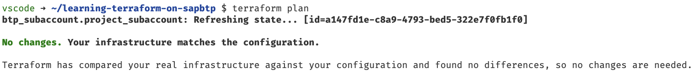

# Unit 3 Lesson 1 - Using Variables in a Terraform Configuration

## Goal 🎯

The goal of this unit is to make the our configuration more flexible by removing the fix values and replacing them with *input variables*.

## Making things more flexible with variables 🛠️

### Basics about input variables

Up to now we used static values in our Terraform configuration, like the subdomain of the global account in the `provider.tf` file or the name of the subaccount in the `main.tf`. This restricts the way we can use the configuration to exactly one scenario, but we want to reuse the configuration to setup different subaccounts with different parameters.

To achieve this we must define so called [input variables](https://developer.hashicorp.com/terraform/language/values/variables) or short *variables*.

Terraform provides a dedicated `variable` block to define them. Here is an example:

```terraform
variable "subaccount_id" {
  type        = string
  description = "The ID of the subaccount on SAP BTP."
}
```

The variable needs to have an identifier, in this case `subaccount_id`. That is the only mandatory information you need to define a variable.

> [!IMPORTANT]
> The name of a variable can be any valid identifier except the following reserved identifiers: `source`, `version`, `providers`, `count`, `for_each`, `lifecycle`, `depends_on` and `locals`.

However there are several optional attributes that we can use to make the usage of the variable easier:

- `type` - This specifies what value types are accepted for the variable. We recommend using this whenever you define a variable.
- `description` - This specifies the input variable's documentation. We recommend using this whenever you define a variable.
- `default` - Add this to define a default value for the input variable. If we add a value here, the variable becomes *optional*.
- `sensitive` - Add this to make Terraform aware that the variable contains sensitive content. This limits Terraform UI output when the variable is used in configuration. However, the value will still be stored in the Terraform state.
- `validation` - This attributes allows us to define additional validation rules on top of the type constraints.
- `nullable` - If you want to specify if the variable can not be null, we must set this value to `false`. The default value is `true`.

Terraform offers several basic types (`string`, `number`, `bool`) as well as complex types (`list`, `set`, `map`, `object`, `tuple`).

Variables are usually stored in a dedicated file called `variables.tf`. They are referenced in the Terraform configuration via `var.<variable_identifier>`.

With these basics we are good to start with rewriting our configuration using variables.

### Cleaning up the configuration

First we create a new file called `variables.tf` in the directory `learning-terraform-on-sapbtp`. This is where we will put our variables that we extract.

Let us start with the `provider.tf` file. Here we have put a fix value for the global account that should certainly be a variable. Consequently we add the following code into the `variables.tf` file:

```terraform
variable "globalaccount" {
  description = "Subdomain of the global account"
  type        = string
}
```
As we have the variable in place we open the `provider.tf` file and replace the static value for the global account with the variable. The provider configuration block now looks like this:

```terraform
provider "btp" {
  globalaccount = var.globalaccount
}
```

Let us continue in the `main.tf` file. We can and certainly should replace all values with variables and their corresponding type. In contrast to the global account we provide a default value for each of the variables namely the value we used in the `main.tf` file. We define the variables by adding the following code to the `variables.tf` file:

```terraform
variable "subaccount_name" {
  description = "Name of the subaccount"
  type        = string
  default     = "DEV Project ABC"
}

variable "subaccount_subdomain" {
  description = "Subdomain of the subaccount"
  type        = string
  default     = "dev-project-abc"
}

variable "subaccount_region" {
  description = "Region of the subaccount"
  type        = string
  default     = "us10"
}

variable "subaccount_beta_enabled" {
  description = "Beta feaatures enabled on subaccount"
  type        = bool
  default     = true
}

variable "subaccount_stage" {
  description = "Stage of the subaccount"
  type        = string
  default     = "DEV"
}

variable "project_costcenter" {
  description = "Cost center of the project"
  type        = string
  default     = "12345"
}
```

Having these variables in place, we can rewrite the `main.tf` which leads to the following code:

```terraform
resource "btp_subaccount" "project_subaccount" {
  name         = var.subaccount_name
  subdomain    = var.subaccount_subdomain
  region       = var.subaccount_region
  beta_enabled = var.subaccount_beta_enabled
  labels = {
    "stage"      = [var.subaccount_stage]
    "costcenter" = [var.project_costcenter]
  }
}
```

> [!TIP]
> It is a good practise to have the variables in alphabetical order. For the sake of the units we omit this parctise and append new variables to the files which makes it easier for you to see waht changed when looking into the solution. In a real setup we recommend sticking to this practise.

Looks good and we have gained more flexibility when we want to use the same configuration for different subaccounts. But, how can we do that? Let us look at this in the next section.

### Providing values for variables

In general, we can provide a dedicated value for every variable we defined. If we do not provide one for optional variables, Terraform will use the default value.

There are different ways to provide values for the variables using:

- the `-var` command line option which would look like this: `terraform apply -var='globalaccount=abc123'`
- environment variables that must follow the naming convention `TF_VAR_<identifier of the variable>` e.g., `TF_VAR_globalaccount`
- in variable definition files. These files have the file ending `.tfvars`

We will use the last option leveraging a `.tfvars` file.

> [!IMPORTANT]
> `.tfvars` files are usually excluded from git and not committed to a source code management system.

We therefore create a new file called `terraform.tfvars` in the directory `learning-terraform-on-sapbtp` and add the following code:

```terraform
globalaccount = "<YOUR GLOBALACCOUNT_SUBDOMAIN>"
```

Replace the placeholder `<YOUR GLOBALACCOUNT_SUBDOMAIN>` with the subdomain of your global account.

> [!NOTE]
> We named the file `terraform.tfvars` as this will be automatically picjed up when executing a command of the Terraform CLI. If you want to name it differently you must add `-var-file=filename` to point the CLI to the right file.

With this the setup is finished now at least for the configuration we provisioned before. But wait a second: aren't there some constraints concerning the variables we defined? We did not think about that when we used static values, but now, maybe it would make sense to bring in some additional validation.

Let's do that!

### Adding validations

Revising our variables it makes sense to add the following validations:

- as we are on an SAP BTP trial account it makes sense to limit the allowed regions to `us10` and `ap21`.
- the stage that we define should match the stages that are used in our company or organization. They should be restricted to the values `DEV`, `TEST` and `PROD`.
- the cost center also needs to have a predefined format namely 5 integers between 0 and 9.

As we have learned the `variable` block has a `validation` block that we can use to implement the validations. The `validation` has the following structure:

```terraform
validation {
    condition     = <Any expression that returns a boolean value>
    error_message = "Put a helpful error message here"
}
```

As we can see we have two arguments:

- the `condition` that points to an expression that must use the value of the variable to return true if the value is valid, or false if it is invalid.
- The `error_message` that can hold any expression that resolves to a string.

As an additional building block that we will use to define the conditions we will especially make use of [functions](https://developer.hashicorp.com/terraform/language/functions) that Terraform provides by default.

Let us cover the first constraint for the region. We want to check if the value provided for the variable is contained in a list that we define. We can use the [contains](https://developer.hashicorp.com/terraform/language/functions/contains) function for that which validates if a given value is part of a list.

We add a corresponding `validation` block to our variable called `subaccount region` resulting in:

```terraform
variable "subaccount_region" {
  description = "Region of the subaccount"
  type        = string
  default     = "us10"
  validation {
    condition     = contains(["us10", "ap21"], var.subaccount_region)
    error_message = "Region must be one of us10 or ap21"
  }
}
```
As `error_message` we added a plain string which is good enough in our setup.

We use the same approach to satisfy the constraint for the stage of the subaccount which leads us to the following code:

```terraform
variable "subaccount_stage" {
  description = "Stage of the subaccount"
  type        = string
  default     = "DEV"
  validation {
    condition     = contains(["DEV", "TEST", "PROD"], var.subaccount_stage)
    error_message = "Stage must be one of DEV, TEST or PROD"
  }
}
```

Last challenge is the cost center. Here we probably need to check via a regular expression. Skimming through the documentation for function we have a [regex](https://developer.hashicorp.com/terraform/language/functions/regex) function that provides what we need to evaluate a regular expression. Taking a second look at the documentation we see that the function does not return a boolean value that we need as condition.

Here another function helps us out namely the [can](https://developer.hashicorp.com/terraform/language/functions/can) function that according to its documentation evaluates the given expression and returns a boolean value indicating whether the expression produced a result without any errors.

With that we are good to go, so let us add the cost center validation leading to the following code:

```terraform
variable "project_costcenter" {
  description = "Cost center of the project"
  type        = string
  default     = "12345"
  validation {
    condition     = can(regex("^[0-9]{5}$", var.project_costcenter))
    error_message = "Cost center must be a 5 digit number"
  }
}
```

With that we have achieved our goal and extracted variables and even added some validations. Let's ensure that everything is formatted and static validation passes:

```bash
terraform fmt
terraform validate
```

No issues found. Now we should check if we messed something up after the rework.

### Executing the changed files

If we made no mistakes the changes should have no impact on our existing configuration and the Terraform state. Let us therefore check if Terraform would identify changes that it needs to make via:

```bash
terraform plan
```

The output should look like this:



That is what we wanted to see and our first small refactoring of the configuration is complete.

## Summary 🪄

We introduced input variables to our configuration to make the setup more flexible. In addition we added several validations for these variables to avoid wrongly configured subaccounts. Great stuff!

With that let us continue with [Unit 3 Lesson 2 - Using locals](../lesson_2/README.md)

## Sample Solution 🛟

You find the sample solution in the directory `units/unit_3/lesson_1/solution_u3_l1`.

## Further References 📝

- [Variables and outputs](https://developer.hashicorp.com/terraform/language/values)
- [Input variables](https://developer.hashicorp.com/terraform/language/values/variables)
- [Input variables - type constraints](https://developer.hashicorp.com/terraform/language/values/variables#type-constraints)
- [Input variables - assigning values](https://developer.hashicorp.com/terraform/language/values/variables#assigning-values-to-root-module-variables)
- [Input variable validation](https://developer.hashicorp.com/terraform/language/expressions/custom-conditions#input-variable-validation)
- [Terraform functions](https://developer.hashicorp.com/terraform/language/functions)
