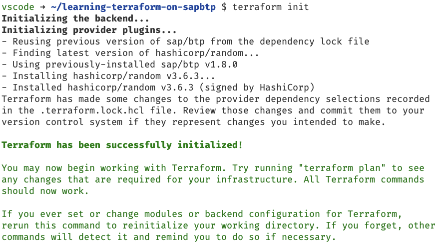
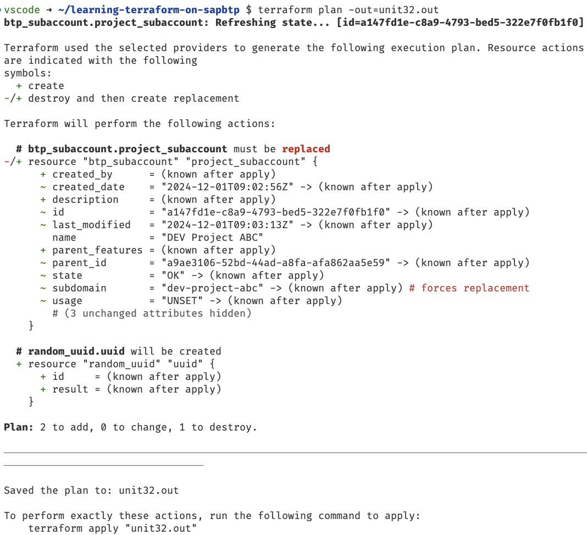
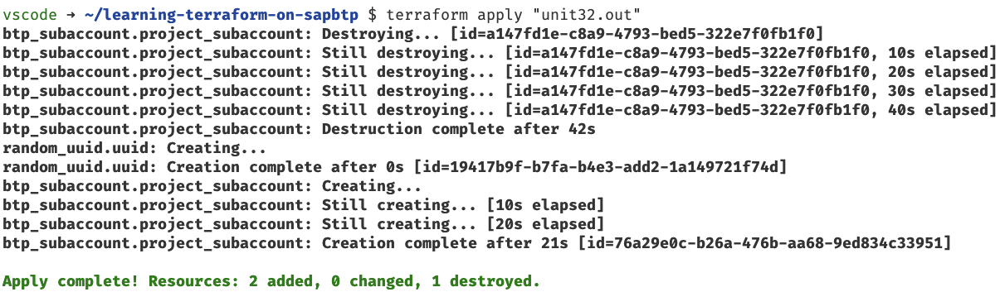

# Unit 3 Lesson 2 - Using Locals

## Goal 🎯

The goal of this unit is to enhance the Terraform configuration with *locals* i.e., to combine several variables into locals.

## Transforming values with local variables 🛠️

One important aspect in our company is to apply naming conventions to our resources. Especially the subaccount needs to follow these guidelines namely:

- the subaccount name must consist of the stage of the project (`DEV`, `TEST` or `PROD`) and the project name
- the subdomain of our subaccounts must follow the template "<stage of the project>-<projectname>-<uuid>" all in lower letters. Any space must be replaced by a "-"

In addition it is corporate governance that no beta features are enables on subaccounts that are in the stage `PROD`

Currently this is not ensured by our Terraform configuration. To achieve this we will:

- rewrite our variables to reflect the necessary input only
- make use of [`local values`](https://developer.hashicorp.com/terraform/language/values/locals)

`Local Values` or `locals` are used in a Terraform configuration to reduce the repetitive usage of values that could be kept in one place and then used at several spots in the configurations. They are also quite useful to transform variables and by this either ensure naming conventions or deduct values from other input values.

### Cleaning up the variables

First we clean up the variables in the `variables.tf` file. We remove the following variables:

- `subaccount_name`
- `subaccount_subdomain`
- `subaccount_beta_enabled`

For the building of the naming convention we add a variable for the project name by adding the following code to the `variables.tf` file:

```terraform
variable "project_name" {
  description = "Name of the project"
  type        = string
  default     = "Project ABC"
}
```

We default it to the already existing name, to make our life easier. The stage is already available as variable `subaccount_stage`, so we can continue with the necessary changes in the `main.tf`.

> [!NOTE]
> You might now see some errors in the `main.tf` as the referenced variables are no longer existing. Don't worry, we will fix this by defining and assigning the local values in the following sections.

### Building the subaccount name

According to the naming convention the subaccount name must the combination of the stage and project name. To achieve this, we open the `main.tf` file and add the following section:

```terraform
locals {
  subaccount_name      = "${var.subaccount_stage} ${var.project_name}"
}
```

The `locals` block defines local values that can then be used in the `main.tf`. In general a local value is always assigned to an expression which could range from a simple direct assignment of e.g., a string or Terraform [expressions](https://developer.hashicorp.com/terraform/language/expressions) or [functions](https://developer.hashicorp.com/terraform/language/functions)

To create the string for the subaccount name we used [string templates](https://developer.hashicorp.com/terraform/language/expressions/strings#string-templates) to join the two string into one.

Now we need to replace the `var.subaccount_name` used in the resource `btp_subaccount` with our newly defined local value. We reference the local value via `local.<local value name>`. Consequently we adjust the code as follows:

```terraform
resource "btp_subaccount" "project_subaccount" {
  name         = local.subaccount_name
  subdomain    = var.subaccount_subdomain
  region       = var.subaccount_region
  beta_enabled = var.subaccount_beta_enabled
  labels = {
    "stage"      = [var.subaccount_stage]
    "costcenter" = [var.project_costcenter]
  }
}
```

Now let's tackle the creation of the subaccount domain.

### Creating the subaccount domain

Besides the transfer of the subdomain to a local value following a naming convention, we also must add a UUID to it. This ensures that it is unique and we do not run into any naming conflicts on SAP BTP.
Terraform offers a resource for the creation of UUIDs out of the box. It is called [`random_uuid`](https://registry.terraform.io/providers/hashicorp/random/latest/docs/resources/uuid).

Let's add this new resource in the `main.tf` file at the top:

```terraform
resource "random_uuid" "uuid" {}
```

This will call the Terraform resource `random_uuid` and create a random UUID, that can be used in our configuration.

Let us  add another code line into the locals section to build the `subaccount_domain`.

```terraform
locals {
  subaccount_name      = "${var.subaccount_stage} ${var.project_name}"
  subaccount_subdomain = join("-", [lower(replace("${var.subaccount_stage}-${var.project_name}", " ", "-")), random_uuid.uuid.result])
}
```

This is now a bit more sophisticated as we combine several functions. Let walk through that from the inside to the outside:

- We use the already known string template to combine the `var.subaccount_stage` and the `var.project_name` and add a "-" in between.
- The resulting string is handed over to the [replace function](https://developer.hashicorp.com/terraform/language/functions/replace). We replace any space (`" "`) in the string by `"-"`
- The resulting string will then be put into lower case via the [`lower` function](https://developer.hashicorp.com/terraform/language/functions/lower).
- The last thing we need is to add the UUID which is taken from the resource `random_uuid` via `random_uuid.uuid.result` and join that with the string we prepared before. We use the [`join` function](https://developer.hashicorp.com/terraform/language/functions/join) using `"-"` as separator.

This gives us the value of the subdomain as we wanted to. Let us finish this and set this local value instead of the variable in the resource configuration, which should now look like this:

```terraform
resource "btp_subaccount" "project_subaccount" {
  name         = local.subaccount_name
  subdomain    = local.subaccount_subdomain
  region       = var.subaccount_region
  beta_enabled = var.subaccount_beta_enabled
  labels = {
    "stage"      = [var.subaccount_stage]
    "costcenter" = [var.project_costcenter]
  }
}
```

Now there is one last thing we need to do.

### Setting the beta flag of the subaccount

We want the deduct the value of the beta flag depending on the stage. We do that by adding another local value called `beta_enabled` to the `locals` block which not looks like this:

```terraform
locals {
  subaccount_name      = "${var.subaccount_stage} ${var.project_name}"
  subaccount_subdomain = join("-", [lower(replace("${var.subaccount_stage}-${var.project_name}", " ", "-")), random_uuid.uuid.result])
  beta_enabled         = var.subaccount_stage == "PROD" ? false : true
}
```

We are using the [`conditionals` expression](https://developer.hashicorp.com/terraform/language/expressions/conditionals) to define the value. Via this expression we state that if the value of the variable `subaccount_stage` is `PROD` the local value is `false` otherwise it is `true`

> [!NOTE]
> You might alos know this type of expression from other programming languages as ternary expression.

Consequently we replace the last variable we wanted to get rid of and the resource for the `btp_subaccount` now looks like this:

```terraform
resource "btp_subaccount" "project_subaccount" {
  name         = local.subaccount_name
  subdomain    = local.subaccount_subdomain
  region       = var.subaccount_region
  beta_enabled = local.beta_enabled
  labels = {
    "stage"      = [var.subaccount_stage]
    "costcenter" = [var.project_costcenter]
  }
}
```

Now that we made the changes, let's see what happens when we apply the changes.

### Applying all our changes

As we have introduced a new resource for the `rando_uuid`, we need to run first:

```terraform
terraform init
```

The output should look like this:



Let's first ensure that everything is formatted and static validation passes:

```bash
terraform fmt
terraform validate
```

Looks good, now let's see that happens if we let Terraform plan the changes:

```terraform
terraform plan -out=unit32.out
```

The output should look like this:



We see that the subaccount will be deleted and created again, as we have assigned a different subdomain to it. This is what we expected by this type of change

> [!CAUTION]
> Always pay special attention, when the Terraform plan tells you it will destroy a resource. This can have serious impact on your landscape and may result in loss of important data or services within a subaccount.

As we are sure, that this is what we want, we apply the changes:

```terraform
terraform apply "unit32.out"
```

The output should look like this:



If we switch back to your SAP BTP cockpit and check the subaccount, we see, that the attributes of the subaccount are set according to our configuration

## Summary 🪄

Locals are a great way to make your Terraform configuration free of unnecessary repetitive expressions. We can also use them to apply naming conventions or derive values from variables.

With that let us continue with [Unit 3 Lesson 3 - Adding additional resources to the Terraform Configuration](../lesson_3/README.md)

## Sample Solution 🛟

You find the sample solution in the directory `units/unit_3/lesson_2/solution_u3_l2`.

## Further References 📝

- [`Local Values`](https://developer.hashicorp.com/terraform/language/values/locals)
- [Terraform expressions](https://developer.hashicorp.com/terraform/language/expressions)
- [Terraform functions](https://developer.hashicorp.com/terraform/language/functions)
- [Resource `random_uuid`](https://registry.terraform.io/providers/hashicorp/random/latest/docs/resources/uuid)
