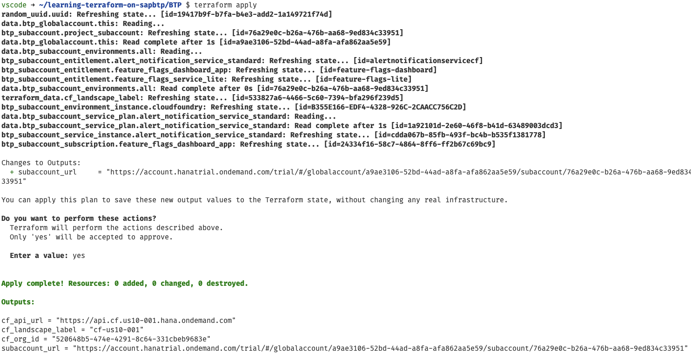
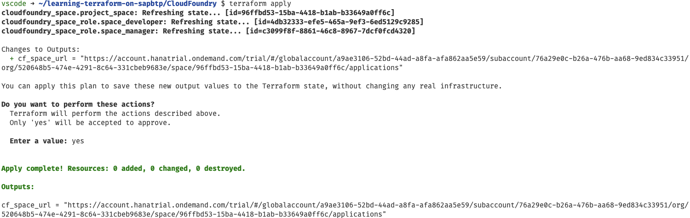

# Unit 4 Lesson 2 - Handing over to the development team

## Goal 🎯

The goal of this unit is to enhance the output of our Terraform configuration for a handover of the setup to a development team.

## Making the handover to development smooth 🛠️

### Motivation

The main purpose of setting up the infrastructure is the enablement of a development team so that the team gets a good starting point and can focus on developing a business application. Probably the development team requested some infrastructure for they project and now we have finished the setup and want to inform them that the setup is ready.

We want to make this as comfortable for the development team as possible, so we want to provide the *URL to the SAP BTP subaccount*, the *URL to the Cloud Foundry space* and the *API endpoint of the Cloud Foundry environment*. This why they do not have to find the right places in a SAP BTP global account, but have everything that they need at hand.

As we already know, we can use output values to surface this information in Terraform and then use this output to transfer it into a ticket, an email or a Microsoft Teams or Slack message.

### Adding the URL to the subaccount

Let us add the information. We already have the API endpoint as part of the output values of the BTP setup. So we need to add the URL of the subaccount. As there is no field that contains this information we must construct it by ourselves. The structure of this URL for our setup on an SAP BTP trial account is:

```terraform
https://account.hanatrial.ondemand.com/trial/#/globalaccount/<Global Account ID>/subaccount/<Subaccount ID>
```

We already have the ID of the subaccount. but we do not yet have the ID of the global account. Luckily there is a data source that we can use to get this information namely the [`btp_globalaccount`](https://registry.terraform.io/providers/SAP/btp/latest/docs/data-sources/globalaccount). We know what we have to do right?

Let us first add this data source to the `main.tf` file in the directory `learning-terraform-on-sapbtp/BTP`. We put it right at the beginning of the file in front of the `locals` block:

```terraform
data "btp_globalaccount" "this" {}
```

Next we add a new output value to the `outputs.tf` in the directory `learning-terraform-on-sapbtp/BTP`:

```terraform
output "subaccount_url" {
  value       = "https://account.hanatrial.ondemand.com/trial/#/globalaccount/${data.btp_globalaccount.this.id}/subaccount/${btp_subaccount.project_subaccount.id}"
  description = "The SAP BTP subaccount URL"
}
```

Here we reference the two IDs, one from the data source for the global account,  the other one form the resource of the subaccount.

That's it. Let's see if it works. We switch to the terminal and make sure that we are in the directory `learning-terraform-on-sapbtp/BTP`. First of course we do our homework by executing:

```bash
terraform fmt
terraform validate
```

No issues as expected, so let us directly apply the changes as they do not result in any changes of the configuration:

```bash
terraform apply
```
We are prompted to accept the changes to the output, which we do as this is what we intended.

The output should look like this:



Excellent, we have the URL as output. Let's switch to the Cloud Foundry space

### Adding the URL to the Cloud Foundry space

The URL to the Cloud Foundry space is constructed in a similar fashion as the URL to the subaccount:

```terraform
https://account.hanatrial.ondemand.com/trial/#/globalaccount/<Global Account ID>/subaccount/<Subaccount ID>/org/<ORG ID>/space/<Space ID>/applications
```

The first part is the same as for the subaccount, we just need to add the ID of the organization as well as the ID of the space. We have that at hand namely via the variable `cf_org_id` or as information from the resource `cloudfoundry_space`.

To get the first part of the URL that we already constructed we decide to use the output value of the previous step as input for the cloud foundry setup. For that we add a variable to the `variables.tf` in the `CloudFoundry` directory:

```terraform
variable "subaccount_url" {
  description = "The SAP BTP subaccount URL"
  type        = string
}
```

We do not use that in the configuration but reference it in the definition of the output values. Next we create a new file called `outputs.tf` in the `CloudFoundry` directory and add the following content:

```terraform
output "cf_space_url" {
  value       = "${var.subaccount_url}/org/${var.cf_org_id}/space/${cloudfoundry_space.project_space.id}/applications"
  description = "The Cloud Foundry space URL"
}
```
We construct the URL by combining the variable `subaccount_url` and filling in the blanks for the ID of the organization using the variable `cf_org_id` and the ID of the space via the corresponding field of the resource `cloudfoundry_space`.

Last thing we need to to is to add the value of the subaccount URL to the `terraform.tfvars` file.

```terraform
subaccount_url     = "<URL of SAP BTP subaccount>"
```

> [!TIP]
> If we do not have it at hand, we can always use the `terraform output` command in the `BTP` directory to get the value

Done. As for the SAP BTP part, let's see if thing work. We switch to the directory `CloudFoundry` and do our homework:

```bash
terraform fmt
terraform validate
```

Looks good, the let's apply the change:

```bash
terraform apply
```

As before we are prompted to accept the changes to the output, which we do as this is what we intended.

The output should look like this:



Success, we made the information that we would like to hand over to our developers available as output values.

## Bonus

To make things more tangible we created a sample setup of this lesson using [GitHub Issues](https://docs.github.com/en/issues/tracking-your-work-with-issues/about-issues) including the [issue form feature](https://docs.github.com/en/communities/using-templates-to-encourage-useful-issues-and-pull-requests/syntax-for-issue-forms) for the request a [GitHub Action](https://docs.github.com/en/actions) to execute the setup and a [GitHub environment](https://docs.github.com/en/actions/managing-workflow-runs-and-deployments/managing-deployments/managing-environments-for-deployment) to model the approval.

The flow is:

1. A team requests a new subaccount via an issue. The requester has to enter some basic information into the form.
1. Once the issue is created a GitHub Action workflow pics up the issue. The workflow is attached to a GitHub deployment environment. Consequently a approval needs to be done by the admin team.
1. After the approval the workflow extracts the information from the issue and starts the provisioning. First the subaccount and the Cloud Foundry Environment get created. The output is used in the second step to create the Cloud Foundry space.
1. Once the deployment finished successfully the issue gets updated with the output relevant for the development team i.e., the URL of the subaccount and the Cloud Foundry space, as well as the API endpoint of the Cloud Foundry environment.

You find the code in the directory `.github/samples`:

- The issue template [`account_request.yml`](.github/samples/account_request.yml)
- The GitHub Action workflow [`project-provisioning.yml`](.github/samples/project-provisioning.yml)

You can also find the corresponding setup in this [GitHub repository](https://github.com/btp-automation-scenarios/terraform-multistep-approval).

## Summary 🪄

To make the onboarding of development teams a smooth experience we added some additional output values to our configuration. We also leveraged one additional data source to fetch the information from our global account.

With that let us continue with [Unit 4 Lesson 3 - Extracting reuseable logic into modules](../lesson_3/README.md)

## Sample Solution 🛟

You find the sample solution in the directory `units/unit_4/lesson_2/solution_u4_l2`.
