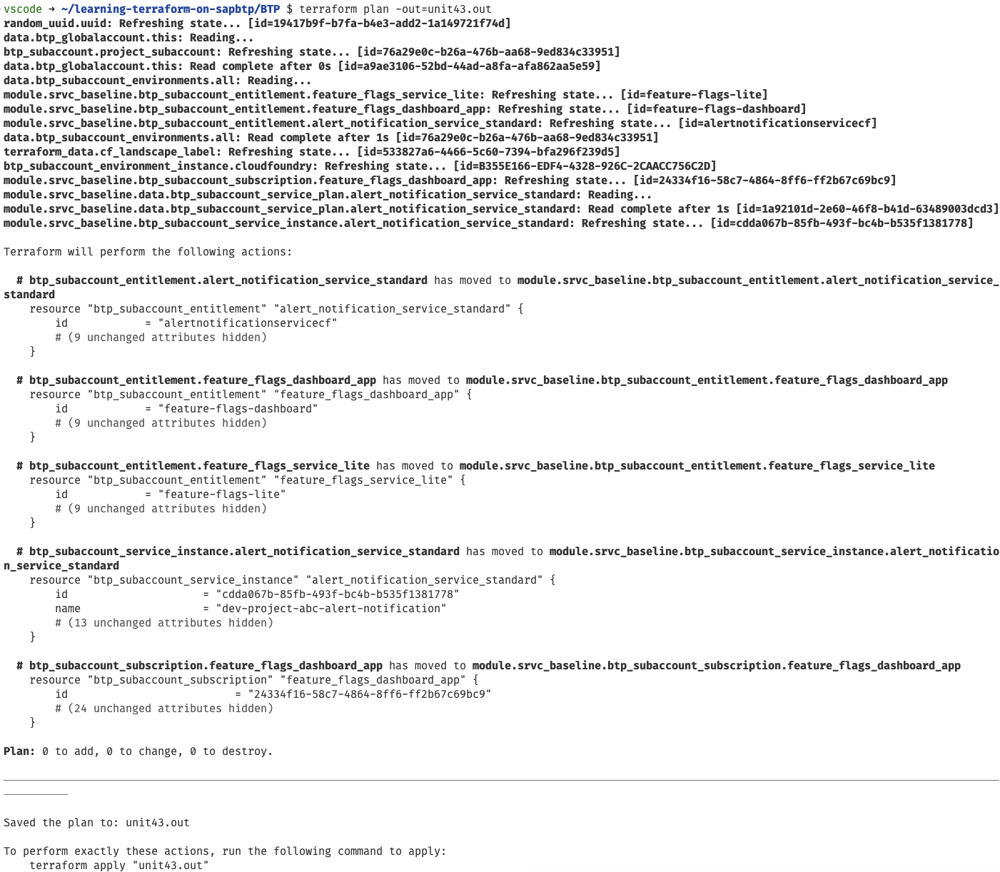
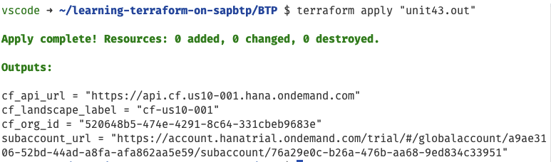

# Unit 4 Lesson 3 - Extracting reuseable logic into modules

## Goal 🎯

The goal of this unit is to make the code better maintainable and re-usable by moving some of our code into *modules*.

## Refactoring with modules 🛠️

Our project code has grown and we want to re-factor it, so that we can better re-use and maintain the code.

> [!NOTE]
> You find more information about refactoring Terraform code in the [official documentation](https://developer.hashicorp.com/terraform/language/modules/develop/refactoring).

For that we  will move out some of out code into a module.

According to the [official Terraform documentations for modules](https://developer.hashicorp.com/terraform/language/modules): "*Modules are containers for multiple resources that are used together. A module consists of a collection of .tf and/or .tf.json files kept together in a directory. Modules are the main way to package and reuse resource configurations with Terraform.*".

And we will take advantage of this concept by moving all of the code into a module that contains a baseline with those BTP services we want to have in subaccounts.

We will do this in three steps:
- create a module directory and move the code to that directory which takes care of the app/service entitlements, service instances and app subscriptions.
- create a set of variables in that module to trigger the provisioning of the services/apps in the module
- change the `main.tf` file to call the module
- ensure that our state information remains stable after the changes

### Creating a module directory for the service baseline

In a first step we create a directory called `modules` and a sub sub-directory called `srvc-baseline`.

In the directory `srvc-baseline` we create two files:
- `srvc_baseline_variables.tf`: this file will create the variables for our module
- `srvc_baseline.tf`: this file contains the main script of the module

Now we copy-and-paste the code from our `main.tf` file that takes care of the entitlements, service instance creation and the app subscriptions into the `srvc_baseline.tf` file (and save it), so that the `srvc_baseline.tf` file looks like this:

```terraform
resource "btp_subaccount_entitlement" "alert_notification_service_standard" {
  subaccount_id = btp_subaccount.project_subaccount.id
  service_name  = "alert-notification"
  plan_name     = "standard"
}

resource "btp_subaccount_entitlement" "feature_flags_service_lite" {
  subaccount_id = btp_subaccount.project_subaccount.id
  service_name  = "feature-flags"
  plan_name     = "lite"
}

resource "btp_subaccount_entitlement" "feature_flags_dashboard_app" {
  subaccount_id = btp_subaccount.project_subaccount.id
  service_name  = "feature-flags-dashboard"
  plan_name     = "dashboard"
}

data "btp_subaccount_service_plan" "alert_notification_service_standard" {
  subaccount_id = btp_subaccount.project_subaccount.id
  name          = "standard"
  offering_name = "alert-notification"
  depends_on    = [btp_subaccount_entitlement.alert_notification_service_standard]
}

resource "btp_subaccount_service_instance" "alert_notification_service_standard" {
  subaccount_id  = btp_subaccount.project_subaccount.id
  serviceplan_id = data.btp_subaccount_service_plan.alert_notification_service_standard.id
  name           = "${local.service_name_prefix}-alert-notification"
}

resource "btp_subaccount_subscription" "feature_flags_dashboard_app" {
  subaccount_id = btp_subaccount.project_subaccount.id
  app_name      = "feature-flags-dashboard"
  plan_name     = "dashboard"
  depends_on    = [btp_subaccount_entitlement.feature_flags_dashboard_app]
}
```

Now we delete the section in the `main.tf` file that we copied over to the `srvc_baseline.tf` file in the directory `modules/srvc-baseline`.

A module can define constraints concerning the required configuration that the Terraform configuration (also known as *calling* module) mus provide. Therefore, we add a section for the provider that we expect to be initialized. For that, we add the following lines into the `srvc_baseline.tf` file:

```terraform
terraform {
  required_providers {
    btp = {
      source = "SAP/btp"
    }
  }
}
```

> [!TIP]
> We could have created a separate provider.tf for that purpose as well within the directory. But as we don't have to provide the provider configuration, we can at it to the `srvc_baseline.tf` file. The provider configuration is taken calling module.

Now we must move the definition of the local variable `service_name_prefix` from the  `main.tf` file to the `srvc_baseline.tf` file, so that the file looks like this:

```terraform
terraform {
  required_providers {
    btp = {
      source = "SAP/btp"
    }
  }
}

locals {
  service_name_prefix = lower(replace("${var.project_stage}-${var.project_name}", " ", "-"))
}

...
```

Delete the `service_name_prefix` local value from the `main.tf` file. The `locals` section in the `main.tf` file then looks like this:

```terraform
locals {
  subaccount_name      = "${var.subaccount_stage} ${var.project_name}"
  subaccount_subdomain = join("-", [lower(replace("${var.subaccount_stage}-${var.project_name}", " ", "-")), random_uuid.uuid.result])
  beta_enabled         = var.subaccount_stage == "PROD" ? false : true
  subaccount_cf_org    = lower(replace("${var.subaccount_stage}-${var.project_name}", " ", "-"))
}
```

That was a big piece of work here but we are not done yet. Let's tackle the next step.

### Create a variables file for the module

A module can be compared to a library or a function that we reuse. In analogy to that we must define the input that the caller must provide and that we need in our configuration.

To accomplish this, we take the following code and paste it into the `srvc_baseline_variables.tf` file, that we created before:

```terraform
variable "subaccount_id" {
  description = "The subaccount ID"
  type        = string
}

variable "project_name" {
  description = "Name of the project"
  type        = string
  default     = "Project ABC"
}

variable "project_stage" {
  description = "Stage of the project"
  type        = string
  default     = "DEV"
  validation {
    condition     = contains(["DEV", "TEST", "PROD"], var.project_stage)
    error_message = "Stage must be one of DEV, TEST or PROD"
  }
}
```

We must replace the reference to the `btp_subaccount.project_subaccount.id` in our `srvc_baseline.tf` that we pulled in when we did the copy &paste from the `main.tf`. This must be replaced in the file with the variable `subaccount_id` that we defined. after the replacement the `srvc_baseline.tf` should look like this:

```terraform
terraform {
  required_providers {
    btp = {
      source = "SAP/btp"
    }
  }
}

locals {
  service_name_prefix = lower(replace("${var.project_stage}-${var.project_name}", " ", "-"))
}

resource "btp_subaccount_entitlement" "alert_notification_service_standard" {
  subaccount_id = var.subaccount_id
  service_name  = "alert-notification"
  plan_name     = "standard"
}

resource "btp_subaccount_entitlement" "feature_flags_service_lite" {
  subaccount_id = var.subaccount_id
  service_name  = "feature-flags"
  plan_name     = "lite"
}

resource "btp_subaccount_entitlement" "feature_flags_dashboard_app" {
  subaccount_id = var.subaccount_id
  service_name  = "feature-flags-dashboard"
  plan_name     = "dashboard"
}

data "btp_subaccount_service_plan" "alert_notification_service_standard" {
  subaccount_id = var.subaccount_id
  name          = "standard"
  offering_name = "alert-notification"
  depends_on    = [btp_subaccount_entitlement.alert_notification_service_standard]
}

resource "btp_subaccount_service_instance" "alert_notification_service_standard" {
  subaccount_id  = var.subaccount_id
  serviceplan_id = data.btp_subaccount_service_plan.alert_notification_service_standard.id
  name           = "${local.service_name_prefix}-alert-notification"
}

resource "btp_subaccount_subscription" "feature_flags_dashboard_app" {
  subaccount_id = var.subaccount_id
  app_name      = "feature-flags-dashboard"
  plan_name     = "dashboard"
  depends_on    = [btp_subaccount_entitlement.feature_flags_dashboard_app]
}
```

Now we are consistent again. Our work in the module is done.

The three variables are now the parameters, that we will need to provide, when calling this module. and that is what we do next.

### Integrating the module into our code

To call the module, we add the following section to the `main.tf`:

```terraform
module "srvc_baseline" {
  source        = "./modules/srvc-baseline"
  subaccount_id = btp_subaccount.project_subaccount.id
  project_name  = var.project_name
  project_stage = var.subaccount_stage
}
```

The setup comprises the following parts:

- the `module` block has the name `srvc_baseline`, that you can use to work with it later on if needed.
- The `source` attribute tells Terraform where to find the module. in this case in the local file system.
- In addition we see the three variables `subaccount_id`, `project_name` and `project_stage` that we have defined before in our module. These variables are assigned with the variables that are known to the `main.tf` file.

So, you might ask yourself, if the code works as before. But that won't happen. The question is why this is the case?

By moving resources from the `main.tf` file to the module, the state file would no longer be able to tell where the resources it created before are located now.

Let us validate this assumption. First we need to initialize the new setup and make Terraform aware that we brought in a new module. We do so by executing

```bash
terraform get
```

The output should look like this:


We can see this be executing the `terraform plan` command that gives us a lengthy output ending with:

```bash
Plan: 5 to add, 0 to change, 5 to destroy.
```

We did not want to change anything. Therefore, there is one last adjustment we must make, namely manipulate the state file to let it know what we've changed and how the new addresses of the already created resources look like.

## Ensure that our state information remains stable

To tell our state that we have moved certain assets in our code, we need to create so called [`moved` blocks](https://developer.hashicorp.com/terraform/language/moved). These blocks instruct Terraform how to handle the moved resources when a state refresh happens. For that we create a new file called `moved.tf` in the same directory as the `main.tf` file.

We copy the following code into the file:

```terraform
moved {
  from = btp_subaccount_entitlement.alert_notification_service_standard
  to   = module.srvc_baseline.btp_subaccount_entitlement.alert_notification_service_standard
}

moved {
  from = btp_subaccount_entitlement.feature_flags_service_lite
  to   = module.srvc_baseline.btp_subaccount_entitlement.feature_flags_service_lite
}

moved {
  from = btp_subaccount_entitlement.feature_flags_dashboard_app
  to   = module.srvc_baseline.btp_subaccount_entitlement.feature_flags_dashboard_app
}


moved {
  from = btp_subaccount_service_instance.alert_notification_service_standard
  to   = module.srvc_baseline.btp_subaccount_service_instance.alert_notification_service_standard
}

moved {
  from = btp_subaccount_subscription.feature_flags_dashboard_app
  to   = module.srvc_baseline.btp_subaccount_subscription.feature_flags_dashboard_app
}
```

You can see that we are listing up all the resources that we have moved from the `main.tf` to the module `srvc_baseline` and re-route their address so that the state file gets get updated accordingly.

### Test our code

Now let's see if things still work. Let's switch to the directory `learning-terraform-on-sapbtp/BTP` and do our homework first:

```bash
terraform fmt
terraform validate
```

Looks good, the let's plan the change:

```bash
terraform plan -out=unit43.out
```

The output should look like this:



This looks like what we wanted to achieve: no changes in the infrastructure but a move of the resources inside of the state.

As we are manipulating the state we want to make a backup before we do so. Better safe than sorry. So copy the file `terraform.tfstate` to `terraform.tfstate.backupu4l3`

Now let us do the necessary and apply the change:

```bash
terraform apply "unit43.out"
```

The result should look like this:



Success, we restructured our code and have a re-usable module to setup our BTP services and apps!

> [!NOTE]
> You can keep the `moved.tf` file in your setup. Terraform will ignore it as it recognizes that no movement of resource addresses is necesary. However, whenever you would add another resource in the future and give it the same address as a resource in the `moved` block you might run into issues. In productive scenarios we there fore recommend to remove the file after the state was updated correctly.

## Summary 🪄

You have learned now the concept of modules to extract reusable configurations. In addition we also realigned the state of the setup after refactoring the configuration via `moved` blocks.

With that let us continue with [Unit 4 Lesson 4 - Iterating over lists in Terraform](../lesson_4/README.md)

## Sample Solution 🛟

You find the sample solution in the directory `units/unit_4/lesson_3/solution_u4_l3`.

## Further References 📝

- [Refactoring](https://developer.hashicorp.com/terraform/language/modules/develop/refactoring)
- [Modules](https://developer.hashicorp.com/terraform/language/modules)
- [`moved` block](https://developer.hashicorp.com/terraform/language/moved)
